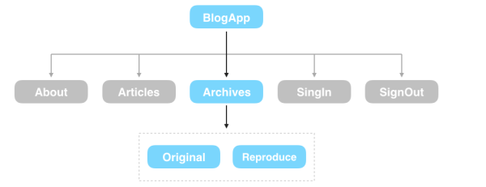

e# 1.路由基本原理
## 1. 基本功能
1. 保证视图和URL的同步,而视图可以看成是资源的一种表现。当用户在页面中进行操作时，应用会在若干个交互状态中切换，路由则可以记录下某些重要的状态，比如在一个博客系统中用户是否登录、在访问哪一篇文章、位于文章归档列表的第几页。而这些变化同样会被记录在浏览器的历史中，用户可以通过浏览器的前进、后退按钮切换状态，同样可以将 URL 分享给好友。
2. 用户可以通过手动输入或者与页面进行交互来改变 URL，然后通过同步或者异步的方式向服务端发送请求获取资源（当然，资源也可能存在于本地），成功后重新绘制 UI，原理如下图所示：

# 2.react-router的状态机特性
1. 我们看到 react-router 中的很多特性都与 React 保持了一致，比如它的声明式组件、组件嵌套，当然也包括 React 的状态机特性，因为毕竟它就是基于 React 构建并且为之所用的。
2. 我们看到 react-router 中的很多特性都与 React 保持了一致，比如它的声明式组件、组件嵌套，当然也包括 React 的状态机特性，因为毕竟它就是基于 React 构建并且为之所用的。
3. 在 react-router 中，我们可以把 Router 组件看成是一个函数，Location 作为参数，返回的结果同样是 UI，二者的对比如下图所示：

# 3.用户点击了Link组件后路由系统中到底发生了哪些变化

1. Link 组件最终会渲染为 HTML 标签 `<a>`，它的 `to、query、hash `属性会被组合在一起并渲染为 href 属性。虽然 Link 被渲染为超链接，但在内部实现上使用脚本拦截了浏览器的默认行为，然后调用了history.pushState 方法（注意，文中出现的 history 指的是通过 history 包里面的 create*History 方法创建的对象，window.history 则指定浏览器原生的 history 对象，由于有些 API 相同，不要弄混）。history 包中底层的 pushState 方法支持传入两个参数 state 和 path，在函数体内有将这两个参数传输到 createLocation 方法中，返回 location 的结构如下：

```javascript
location = {
  pathname, // 当前路径，即 Link 中的 to 属性
  search, // search
  hash, // hash
  state, // state 对象
  action, // location 类型，在点击 Link 时为 PUSH，浏览器前进后退时为 POP，调用 replaceState 方法时为 REPLACE
  key, // 用于操作 sessionStorage 存取 state 对象
};
```

2. 系统会将上述 `location `对象作为参数传入到 `TransitionTo `方法中，然后调用 `window.location.hash` 或者`window.history.pushState()` 修改了应用的 `URL`，这取决于你创建` history `对象的方式。同时会触发`history.listen` 中注册的事件监听器。

3. 接下来请看路由系统内部是如何修改` UI` 的。在得到了新的` location `对象后，系统内部的 `matchRoutes` 方法会匹配出` Route` 组件树中与当前` location `对象匹配的一个子集，并且得到了 `nextState`，具体的匹配算法不在这里讲解，感兴趣的同学可以点击查看，`state` 的结构如下：
```
nextState = {
  location, // 当前的 location 对象
  routes, // 与 location 对象匹配的 Route 树的子集，是一个数组
  params, // 传入的 param，即 URL 中的参数
  components, // routes 中每个元素对应的组件，同样是数组
};
```
4. 在 `Router` 组件的 `componentWillMount` 生命周期方法中调用了 `history.listen(listener)` 方法。`listener` 会在上述 `matchRoutes` 方法执行成功后执行` listener(nextState)`，`nextState `对象每个属性的具体含义已经在上述代码中注释，接下来执行` this.setState(nextState)` 就可以实现重新渲染 `Router `组件。举个简单的例子，当 `URL`（准确的说应该是 `location.pathname`） 为 `/archives/posts` 时，应用的匹配结果如下图所示：

5. 到这里，系统已经完成了当用户点击一个由 Link 组件渲染出的超链接到页面刷新的全过程
# 4.前端路由如何处理浏览器的前进和后退功能
1. 可以简单地把 web 浏览器的历史记录比做成一个仅有入栈操作的栈，当用户浏览器到某一个页面时将该文档存入到栈中，点击「后退」或「前进」按钮时移动指针到 history 栈中对应的某一个文档。在传统的浏览器中，文档都是从服务端请求过来的。不过现代的浏览器一般都会支持两种方式用于动态的生成并载入页面
## `location.hash 与 hashchange`

这也是比较简单并且兼容性也比较好的一种方式，详细请看下面几点：

- 使用 `hashchange` 事件来监听 `window.location.hash` 的变化
- `hash` 发生变化浏览器会更新 `URL`，并且在 `history` 栈中产生一条记录
- 路由系统会将所有的路由信息都保存到 `location.hash` 中
- 在 `react-router` 内部注册了 `window.addEventListener('hashchange', listener, false)` 事件监听器
- `listener` 内部可以通过 `hash fragment` 获取到当前 `UR`L 对应的 location 对象
- 接下来的过程与点击` <Link/>` 时保持一致

当然，你会想到不仅仅在前进和后退会触发 `hashchange` 事件，应该说每次路由操作都会有 `hash` 的变化。确实如此，为了解决这个问题，路由系统内部通过判断` currentLocation `与 `nextLocation` 是否相等来处理该问题。不过，从它的实现原理上来看，由于路由操作` hash` 发生变化而重复调用 `transitonTo(location)` 这一步确实无可避免，这也是我在上图中所画的虚线的含义。

这种方法会在浏览器的 `URL` 中添加一个 `#` 号，不过出于兼容性的考虑`（ie8+）`，路由系统内部将这种方式（对应` history` 包中的 `createHashHistory` 方法）作为创建 `history` 对象的默认方法。
## `history.pushState 与 popstate`
新的 HTML5 规范中还提出了一个相对复杂但更加健壮的方式来解决该问题，请看下面几点：

- 上文中提到了可以通过 `window.history.pushState(state, title, path) `方法（更多关于 `history` 对象的详细` API` 可以查看这里）来改变浏览器的 `URL`，实际上该方法同时在 `history `栈中存入了 `state `对象。
- 在浏览器前进和后退时触发 `popstate `事件，然后注册 `window.addEventListener('popstate', listener, false)` ，并且可以在事件对象中取出对应的 `state `对象
- `state` 对象可以存储一些恢复该页面所需要的简单信息，上文中已经提到 `state` 会作为属性存储在` location` 对象中，这样你就可以在组件中通过` location.state` 来获取到
- 在 `react-router `内部将该对象存储到了 `sessionStorage` 中，也就是上图中的 `saveState` 操作
- 接下来的操作与`第一种方式一致


使用这种方式（对应 history 包中的 createHistory 方法）进行路由需要服务端要做一个路由的配置将所有请求重定向到入口文件位置，你可以参考这个示例，否则在用户刷新页面时会报 404 错误。

实际上，上面提到的 state 对象不仅仅在第二种路由方式中可以使用。react-router 内部做了 polyfill，统一了 API。在使用第一种方式创建路由时你会发现 URL 中多了一个类似 _key=s1gvrm 的 query，这个 _key就是为 react-router 内部在 sessionStorage 中读取 state 对象所提供的。