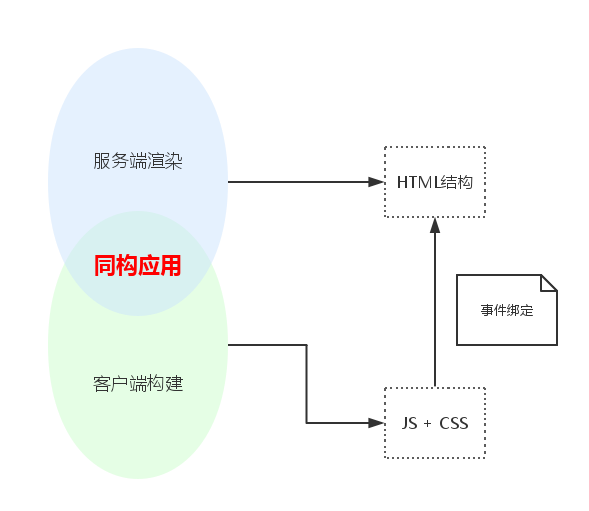

# CNODE
## 项目介绍
`WebPack + React` 全栈项目
虽然现在有 `create-react-app` 但是不知道整个项目如何运转的

## 项目结构
1. 工程架构
    1. `webpack`配置
        1. 开发环境的`devServer`
        2. 正式环境的打包流程
        3. 服务端渲染的基础配置
            1. 开发时要考虑如何更新服务端渲染中每次需要用到的模块
            2. 基础`webpack`配置，编译`JSX`代码到浏览器端运行
            3. 如何处理图片等静态文件
    2. `node`服务
    3. 服务端渲染基础
2. 项目架构
    1. `React`基础配置
        1. 数据仓库配置 `store`
    2. `React-Router`配置
        1. 路由配置
        2. 声明式的方法开发路由
    3. `Mobx`配置
        1. `store` 部分 用`mobx`
        2. 相对`redux`使用方式更加简单
        3. 没有`action`、`dispatch`等多个数组
        4. `mobx`运行效率比`redux`高，mobx更新数据精度更高。redux更新数据都全量更新，主要依靠react的高效虚拟dom才能撑住，mobx不需要考虑这个问题，可以跟踪到最小精度的数据变化
    4. 服务端渲染配置
        1. 服务端渲染的基础配置
        2. 针对路由跳转进行优化
        3. 针对数据同步进行优化

3. 业务开发
    1. 页面服务
    2. 登录服务
    3. 服务端渲染优化
        1. 用户本地资源缓存

4. 项目部署
    1. PM2 部署nodejs进程
    2. Nginx 做反向代理
    3. 一键部署 使用PM2一键部署功能
## 最难的部分
## 有什么收获
## 最有意思的部分
## 最难解的bug
## 最享受的过程

## 问题
1. 为什么能在不刷新页面的前提下展示刚刚修改的代码？
2. 如何操作能让正式上线的代码优化到极致？
3. 如何配合webpack调试React的服务端渲染？
4. React服务端渲染是什么东西？
    1. 所有的HTML内容都是通过JS在浏览器中进行生成，输入URL得到没有内容的HTML,等HTML引用JS中的代码，渲染出来它的内容，才会正确地加载出来
    2. 通过React提供的服务端渲染方法，我们可以在服务器上生成DOM结构，让用户尽早看到页面内容，但是一个能够work的页面不仅仅是DOM结构，还包括了各种事件响应、用户交互。那么意味着，在客户端上，还得执行一段JS代码绑定事件、处理异步交互，在React中，意味着整个页面的组件需要重新渲染一次，反而带来了额外的负担。
    3. 因此，在服务端渲染中，有一个十分重要的概念， 同构(Isomorphic) ，在服务端和客户端中，使用完全一致的React组件，这样能够保证两个端中渲染出的DOM结构是完全一致的，而在这种情况下，客户端在渲染过程中，会判断已有的DOM结构是否和即将渲染出的结构相同，若相同，不重新渲染DOM结构，只是进行事件绑定。
    4. 在同构应用中，一套代码（不局限于组件），能够同时在客户端和服务端运行，总体结构如下：
        
    5. 
5. 为什么要做React服务端渲染(SPA存在的一些问题)
    1. SEO不友好
        1. SEO 需要解析URL中返回的内容，然后再去做SEO，单页应用加载的时候HTML中没有任何内容。所以SEO抓不到任何东西
    2. 首屏时间较长，用户体验差
        1. 要等所有的JS加载完成之后，再去渲染里面的内容，这个时间比我们直接加载HTML，先渲染CSS，然后再去引用JS的时间长很多
    3. 并不给一个打包完成的APP，调用`ReactDOM.serverRendering`就OK，难点在于如何去配置，能够打包出我们在服务端渲染中能用的APP
    4. 在 Server Rendering 时，和前端相比组件没有完整的生命周期，只会走到 componentWillMount（因为不存在挂载之后的变化）。所以实际上组件只有一次 render，我们就需要提前取完业务数据再去执行，保证 render 出来是有数据的状态。
6. 服务端渲染需要考虑的问题
    1. 数据同步
        1. store 的初始状态在Server端生成，为了保持两个端中store的一致，官方示例中通过在页面插入脚本的方式，写入store初始值到window：
        2. 单一的 Store 数据树来记录数据的特点，在服务端渲染时做起来也很容易。只要在最后直出时把当前 State 的 JSON 输出到前端
        3. 此处输出initialState到页面中，是十分危险的，一定要注意XSS的防范.可以使用`serialize-javascript`
    2. 路由跳转
        1. StaticRouter
    3. SEO信息
    4. 在开发的时候，使用devServer 拿不到可以在本地可以运行的APP，如何在开发的时候方便地进行服务端渲染的测试

## 衍生问题
1. webpack原理
2. koa洋葱模型
3. redux && mobx原理
4. react diff算法
5. react 生命周期函数
6. react 表单
    1. 问题
        1. 给input上设置了一个默认值：突然你发现，唉我擦！输入框里的值不能改动了，删也删不掉。你以为电脑卡死了，刷新了几遍还是这样。然而把value删除就复原了，你不得不又返回去看文档。
    2. 原理：在React中表单组件分为约束组件和无约束组件两种。
        - 无约束组件（非受控组件），是指其value值不通过的props或者state来设置，仅由其自身来决定。表单组件的值的变化也不会被记录，只能通过找到DOM节点的方式来获取。
        - 约束组件（受控组件），是React中推荐的表单的使用方式。表单组件的值并不是由其自身决定，而是通过父组件传递或者本身的state来控制。其内容的每次变化都会被保存，需要时仅需要通过this.state便能获取。
7. 